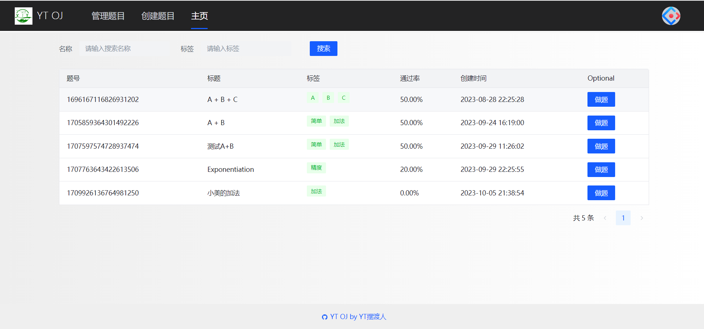
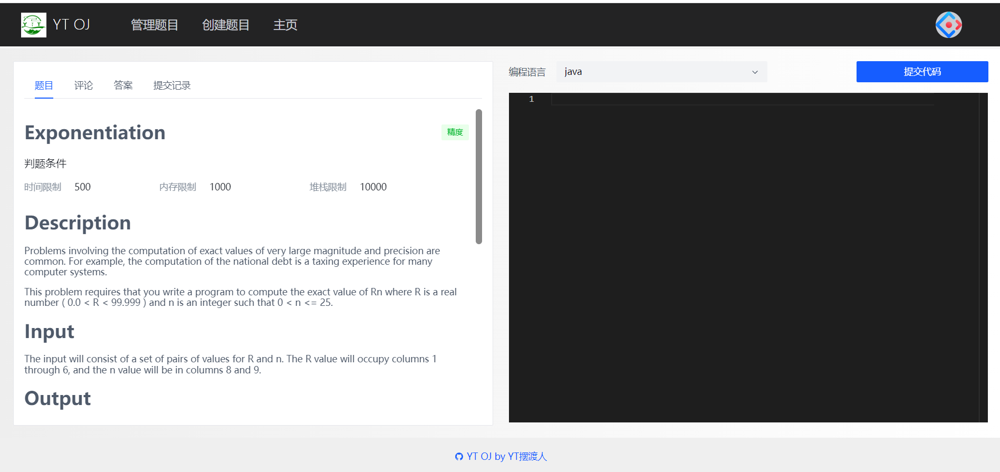
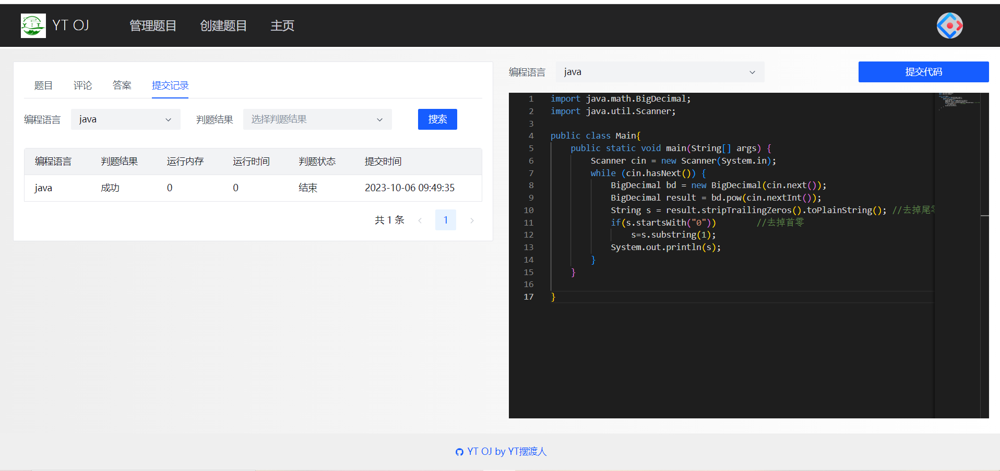
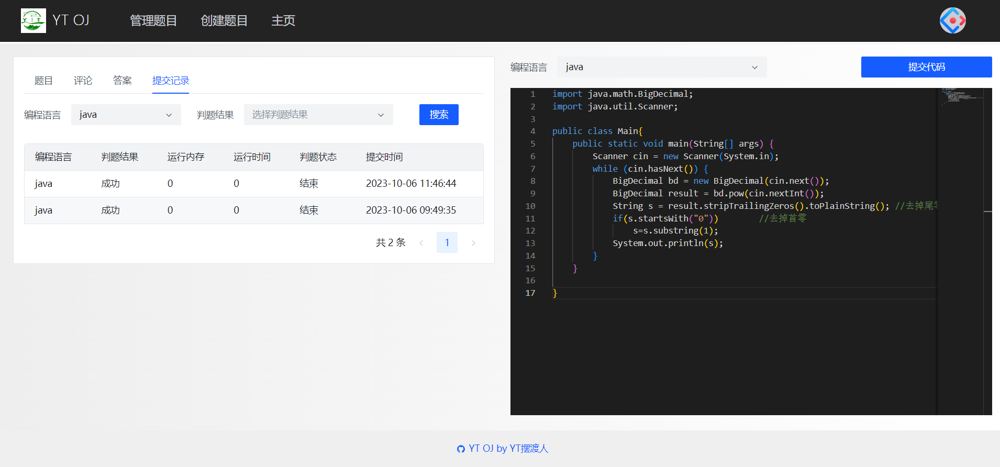
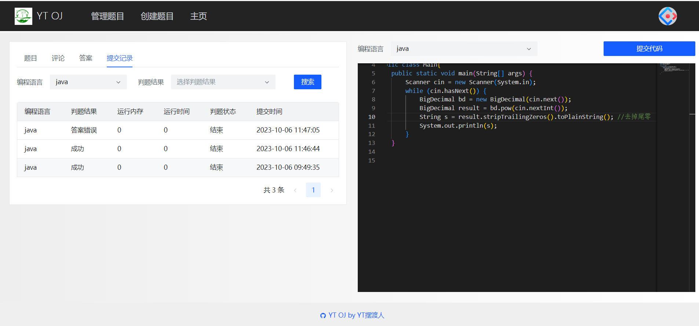
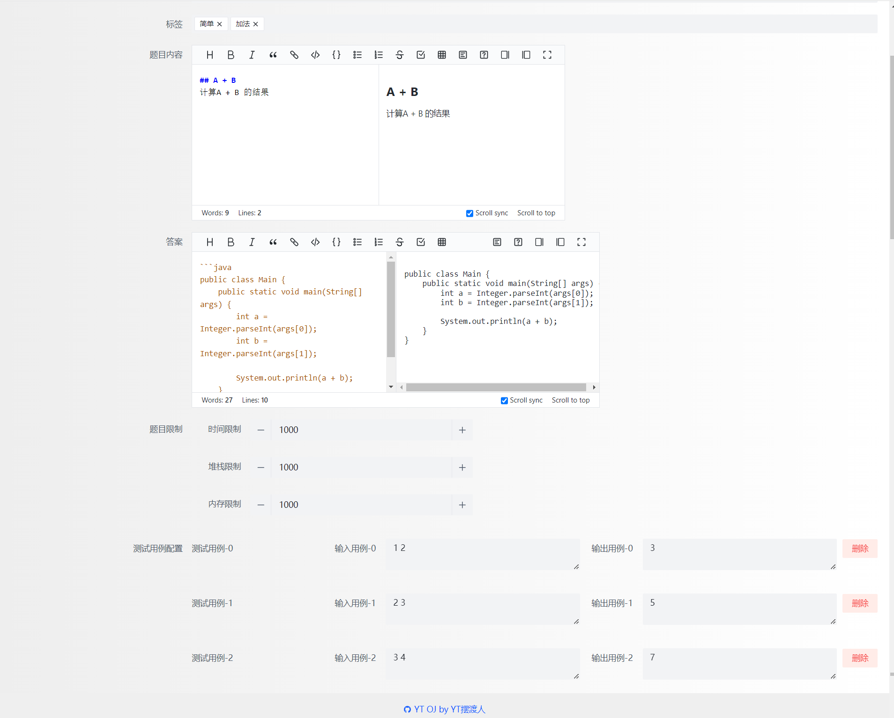

# 在线OJ项目2.0

基于Spring Cloud 微服务 + RabbitMQ + Docker (前端使用vue3) 的在线OJ系统，能够根据管理员预设的判题用例进对用户提交的代码判断是否能够正常执行，并且抽离了一个代码沙箱保证判题系统的安全性。 

### 前端：

1. 使用Vue3 + Arco Design 组件库

### 后端：

1. 由于判题逻辑复杂，且不同题目的判题算法可能不同，选用策略模式代替if-else 独立封装了不同语言的判题算法，提高系统的可维护性
2. 使用代理模式对代码沙箱接口进行能力增强，统一实现了对代码沙箱调用前后日志记录，减少同步代码
3. 使用 Java Runtime 对象的exec方法多进程编译执行Java程序，并通过Process类的输入流获取执行结果
4. 使用Java安全管理器和自定义的Security Manager对用户提交的代码进行权限控制，比如关闭写文件，执行文件权限，进一步提升代码沙箱的安全性
5. 为保证宿主机的稳定性，选用Docker隔离用户代码，使用Docker Java库操作Docker容器，通过tty和Docker进行传参交互，从而实现了更安全的代码沙箱
6. 为提高Docker代码沙箱的安全性，通过HostConfig限制了容器的内存限制和网络隔离，并通过设置容器的超时时间解决资源未释放的问题
7. 使用模板方法定义了一套代码沙箱的标准流程，提高代码一致性并简化冗余代码
8. 为保证项目各模块稳定，使用Spring Cloud Alibaba重构项目（使用Redis分布式Session存储用户登录信息），并将项目划分为不同模块
9. 使用Spring Cloud Gateway 对各服务接口进行聚合和路由，保护服务的同时也简化客户端的调用，并通过CorsWebFilter Bean全局解决跨域问题，使用Knife4j Gateway在网关层面实现了对各服务Swagger接口文档的统一聚合
10. 为防止判题操作时间过长，系统选用异步的方式，在判题服务中将用户提交id发送给RabbitMQ消息队列，并通过Direct交换机转发给判题队列，由判题服务进行消费，异步更新提交状态。

## 效果展示

点击做题：

提交错误的代码：

新增和修改题目页面：

