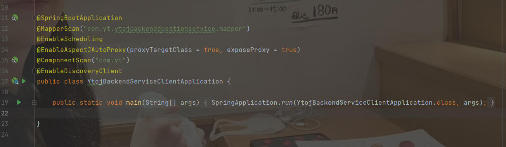

  

# 在线OJ项目重构

目的：之前的OJ项目主要是增删改查，本次重构主要是为了提升对前端技术的掌握和多了解一些docker的知识


主要开发功能设计：

1. 题目模块
   1. 题目的增删改查
   2. 搜索题目
   3. 在线做题
   4. 提交题目
2. 用户
   1. 登录
   2. 注册
3. 判断题目模块
   1. 提交题目（判断结果对错）
   2. 错误处理（内存溢出、安全性、超时）
   3. 实现代码沙箱（隔离环境）
   4. （接口）


### 技术实现

Vue3，Java进程控制，虚拟机，Docker，消息队列

开始开发：

## 2023-7-29

使用组件库：

> https://arco.design/react/docs/start

使用vue-router动态路由

使用vuex全局状态管理

## 2023-7-30

使用vue-router的权限管理

需要在全局页面组件中，绑定一个全局路由监听，每次访问页面的时候，根据用户需要访问的页面的路由信息，先判断用户是否有访问权限

如果有，跳转，如果没有，就拦截或者是跳转到403或者401鉴权或者是登录页面

##### 如何根据权限隐藏菜单

在 routers.ts 中给路由新增一个标志位，用于判断路由是否显隐

不要使用v-if + v-for 去进行条件渲染，会导致性能的浪费

所以先过滤需要展示的页面

需要抽象出一个全局的权限管理


后端项目初始化

然后后端暴露swagger接口，然后使用代码生成工具构建请求函数

> https://github.com/ferdikoomen/openapi-typescript-codegen

```
openapi --input http://localhost:8123/api/v2/api-docs --output ./generated --client axios
```

## 2023-8-7

数据库字段：

使用 judgeConfig 判题配置（json对象）

- 时间限制 timeLimit
- 内存限制 memoryLimit

judge 判题用例（json数组）

每个元素是：一个输入用例和一个输出用例

```json
[
    {
        "input": "1 2",
        "output": "3 4"
    },
    {
        "input": "1 3",
        "output": "2 4"
    }
]
```

存json的前提：

1. 不需要根据json中的某个字段去查询这条数据
2. 你的字段含义相关，属于同一类的值
3. 你的字段存储空间不能占用太大

判题信息：

```json
judgeInfo
{
    "message": "执行信息",
    "time": 1000, // ms
    "memory": 1000 // kb
}
```

判题枚举值：

- Accepted 成功
- Wrong Answer 失败错误
- Compile Error 编译错误
- Memory Limit Exceeded 内存溢出
- Time Limit Exceeded 超时
- Presentation Error 展示错误
- Output Limit Exceeded 输出溢出
- Waiting 等待中
- Dangerous Operation 危险操作
- Runtime Error 运行错误（用户程序问题）
- System Error 系统错误（系统内的问题）

## 2023-8-8

编写独立的实体类entity，DTO，VO等

## 2023-8-14

使用md编辑器：

> [bytedance/bytemd: Hackable Markdown Editor and Viewer (github.com)](https://github.com/bytedance/bytemd)

引入代码编辑器： monaco-editor

> [microsoft/monaco-editor: A browser based code editor (github.com)](https://github.com/microsoft/monaco-editor)
>
> npm install monaco-editor

> 安装：使得代码编辑器和webpack整合
>
> npm install monaco-editor-webpack-plugin

vue-cli项目/ webpack项目整合 Webpack项目

```js
const { defineConfig } = require("@vue/cli-service");
const MonacoWebpackPlugin = require("monaco-editor-webpack-plugin");
module.exports = defineConfig({
  transpileDependencies: true,
  chainWebpack(config) {
    config.plugin(new MonacoWebpackPlugin({}));
  },
});
```


## 2023-9-7

### 代码沙箱的开发

定义代码沙箱的接口，提高通用性

之后的项目代码只调用接口，不调用具体的实现类，这样在使用其他的代码沙箱实现类的时候，就不用去修改名称了，便于拓展

```java
@Data
@Builder
@NoArgsConstructor
@AllArgsConstructor
```

使用工厂模式，根据用户传入的字符串参数，来生成对应的代码沙箱实现类

此处使用静态工厂某事，实现比较简单，符合需求

参数配置化。。。

##### 如何进行代码沙箱能力增强：

比如在调用代码沙箱前，输出请求参数日志，在代码沙箱调用后，输出响应结果日志，便于管理员去分析

使用代码模式，提供一个Proxy来增强代码沙箱的能力

使用代理后，不仅不用改变原来的代码沙箱实现类，而且对于调用者来说，调用方式没有改变

### 判题服务完整业务流程开发

1）传入题目提交id，获取到对应的题、提交信息（包含代码、编程语言等）

如果题目的提交状态不为等待中，就不需要再提交了

2）更改题目提交的状态为 判题中，防止重复执行，也能让用户堪当状态

2）调用沙箱，获取到题目执行结果

3）根据沙箱的执行结果，设置题目的判题状态和信息

```
if (status.equals(QuestionSubmitStatusEnum.Failed.getValue())) {
            // 代码执行返回异常
            questionSubmitUpdate.setStatus(QuestionSubmitStatusEnum.Failed.getValue());
            questionSubmitUpdate.setJudgeInfo(gson.toJson(judgeInfo));
            boolean updateById = questionSubmitService.updateById(questionSubmitUpdate);
            ThrowUtils.throwIf(!updateById, ErrorCode.SYSTEM_ERROR, "修改提交状态异常");
            throw new BusinessException(50005, "执行代码异常:" + judgeInfo.getMessage());
        }

        Boolean res = judgeOutputList(outputList, outputListByExecute);
        if (res.equals(true)) {
            questionSubmitUpdate.setStatus(QuestionSubmitStatusEnum.SUCCEED.getValue());
            questionSubmitUpdate.setJudgeInfo(gson.toJson(judgeInfo));
            boolean updateById = questionSubmitService.updateById(questionSubmitUpdate);
            ThrowUtils.throwIf(!updateById, ErrorCode.SYSTEM_ERROR, "修改提交状态异常");
        } else {
            questionSubmitUpdate.setStatus(QuestionSubmitStatusEnum.Failed.getValue());
            questionSubmitUpdate.setJudgeInfo(gson.toJson(judgeInfo));
            boolean updateById = questionSubmitService.updateById(questionSubmitUpdate);
            ThrowUtils.throwIf(!updateById, ErrorCode.SYSTEM_ERROR, "修改提交状态异常");
        }

        //设置返回结果并返回
        QuestionSubmitVO questionSubmitVO = new QuestionSubmitVO();
        questionSubmitVO.setJudgeInfo(judgeInfo);
        questionSubmitVO.setStatus(status);
```

这里需要使用策略模式，根据不同的情况进行判题


#### 主要流程

##### 1. 获取到代码

通过读取文件流的方式

##### 2. 通过调用命令行的方式进行编译

```java
String compileCmd = String.format("javac -encoding utf-8 %s", userCodeFile.getAbsolutePath());
Process compileProcess = Runtime.getRuntime().exec(compileCmd);
```

##### 3. 执行程序

```
String runCmd = String.format("java -Dfile.encoding=UTF-8 -cp %s Main %s", userCodeParentPath, inputArgs);
```

需要注意编码问题，要指定编码

##### 4. 最后整理到输出结果

得到运行时间：使用StopWatch

##### 5. 还需要进行文件清理

##### 6. 异常错误返回空数据

## 2023-9-10

处理危险代码带来的问题

#### 1. 超时控制

通过创建一个守护线程，超时后中断process实现

```
// 超时控制
FutureTask<Integer> futureTask = new FutureTask<>(() -> {
    try {
        Thread.sleep(TIME_OUT);
        if (process.isAlive()) {
            process.destroy();
            System.out.println("超时了，中断");
            // 有一个中断就不执行后面可能有问题的输入了
            return 1;
        }
    } catch (InterruptedException e) {
        e.printStackTrace();
    }
  return 0;
});
new Thread(futureTask).start();
Integer res = futureTask.get();
if (res == 1) {
    ifLongTime = 1;
    break;
}
```


#### 2. 限制资源的分配

不能够让每个Java进程的执行占用的JVM最大内存空间都和系统的一致，实际上应该小一点，比如说256MB

启动Java时，可以指定JVM的参数，-Xmx256m

```
java -Xmx256m
```

这里使用的JVM的堆内存限制，不等于系统实际占用的最大资源，可能会超出

如果需要更为严格的内存限制，需要到系统层面进行限制

如果时Linux系统，可以使用cgroup来实现对某个进程的cpu、内存等资源的分配

#### 3. 限制代码

定义黑白名单，使用工具库的中的WordTree，提手匹配效率

#### 4. 限制用户的操作权限

限制用户对文件、内存、CPU、网络等资源的操作和访问

使用Java安全管理器来实现更严格的限制

首先是创建一个类继承SecurityManager

```java
package com.yt.ytojcodesandbox.security;

import java.security.Permission;

public class MySecurityManager extends SecurityManager{

    @Override
    public void checkPermission(Permission perm) {
        // 不做任何限制
        //super.checkPermission(perm);
    }

    // 检测程序是否可执行文件
    @Override
    public void checkExec(String cmd) {
        throw new SecurityException("checkExec 权限异常:" + cmd);
    }

    // 检测程序是否可以读文件
    @Override
    public void checkRead(String file) {
        throw new SecurityException("checkRead 权限异常:" + file);
    }

    // 检测程序是否允许写文件
    @Override
    public void checkWrite(String file) {
        throw new SecurityException("checkWrite 权限异常:" + file);
    }

    // 检测程序是否允许删除文件
    @Override
    public void checkDelete(String file) {
        throw new SecurityException("checkDelete 权限异常:" + file);
    }

    // 检测程序是否允许连接网络
    @Override
    public void checkConnect(String host, int port) {
        throw new SecurityException("checkConnect 权限异常:" + host + ":" + port);
    }
}
```

这里尽量限制用户输入代码的权限

想要在用户输入的所有代码中统一加上这个manager限制，需要在运行时的命令行中进行限制

```
java -Xmx256m -Dfile.encoding=UTF-8 -cp %s;%s -Djava.security.manager=MySecurityManager Main %s
```

这里需要注意，在windows中路径是使用%s;%s，在linux下是使用%s:%s

然后需要先编译

```
javac -encoding utf-8 ./MySecurityManager.java
```

然后需要将编译后的路径指定到代码中

```java
private static final String SECURITY_MANAGER_PATH = "E:\\gitee\\yt-oj-project\\ytoj-code-sandbox\\src\\main\\resources\\security";

public static final String SECURITY_MANAGER_CLASS_NAME = "MySecurityManager";
```

```java
String runCmd = String.format("java -Xmx256m -Dfile.encoding=UTF-8 -cp %s;%s -Djava.security.manager=%s Main %s",
                    userCodeParentPath, SECURITY_MANAGER_PATH, SECURITY_MANAGER_CLASS_NAME, inputArgs);
```


## 2023-9-11

使用代码沙箱进行隔离

之前都是在代码层面进行隔离，所以只要是在代码层面出现漏洞就会出现问题

为了提升系统的安全性，把不同的程序和宿主机进行隔离，使得某个程序的执行不会影响到系统本身


1）Docker运行在Linux内核上

2）CGroups：实现容器的资源隔离，底层是Linux Cgroup命令，能够控制进程使用的资源

3）Network网络：实现容器的网络隔离，docker容器内部的网络互不影响

4）Namespaces命名空间：可以把进程隔离在不同的命名空间下，每个容器他都可以有自己的命名空间，不同的命名空间下的进程互不影响

5）Storage存储空间，容器内部的文件是相互隔离的，也可以去使用宿主机的文件

地址：https://hub.docker.com/

> docker create xxx 启动实例，得到容器实例containerId

docker ps -a 查看容器状态


## 2023-9-12

要使用Java操作docker https://github.com/docker-java/docker-java

```xml
<!-- https://mvnrepository.com/artifact/com.github.docker-java/docker-java -->
<dependency>
    <groupId>com.github.docker-java</groupId>
    <artifactId>docker-java</artifactId>
    <version>3.3.0</version>
</dependency>
<!-- https://mvnrepository.com/artifact/com.github.docker-java/docker-java-transport-httpclient5 -->
<dependency>
    <groupId>com.github.docker-java</groupId>
    <artifactId>docker-java-transport-httpclient5</artifactId>
    <version>3.3.0</version>
</dependency>
```

DockerClientConfig：用于定义初始化DockerClient 的配置（类比MySQL的连接、线程数配置）

DockerHttpClient：用于向Docker守护进程（操作Docker的接口）发送请求的的客户端，低层封装，不推荐使用，要自己构建请求参数

DockerClient：才是真正和Docker守护进程交互的、最方便的SDK，高层封装，对DockerHttpClient再进行了一层封装


#### 远程连接开发

如果不能正常启动：


输入配置：

```
-Djdk.lang.Process.launchMechanism=vfork
```

##### 通过代码拉取镜像

```java
package com.yt.ytojcodesandbox.docker;

import com.github.dockerjava.api.DockerClient;
import com.github.dockerjava.api.command.PingCmd;
import com.github.dockerjava.api.command.PullImageCmd;
import com.github.dockerjava.api.command.PullImageResultCallback;
import com.github.dockerjava.api.model.PullResponseItem;
import com.github.dockerjava.core.DockerClientBuilder;

public class DockerDemo {

    public static void main(String[] args) {
        // 获取默认的 Docker Client

        DockerClient dockerClient = DockerClientBuilder.getInstance().build();
        String image = "nginx:latest";
        PullImageCmd pullImageCmd = dockerClient.pullImageCmd(image);
        PullImageResultCallback pullImageResultCallback = new PullImageResultCallback(){

            @Override
            public void onNext(PullResponseItem item) {
                System.out.println("下载镜像");
                super.onNext(item);
            }
        };
        try {
            pullImageCmd.exec(pullImageResultCallback).awaitCompletion();
            System.out.printf("下载完成");
        } catch (InterruptedException e) {
            throw new RuntimeException(e);
        }
    }
}
```

## 2023-9-17

docker 的一些操作

```java
package com.yt.ytojcodesandbox.docker;

import com.github.dockerjava.api.DockerClient;
import com.github.dockerjava.api.command.*;
import com.github.dockerjava.api.model.Container;
import com.github.dockerjava.api.model.Frame;
import com.github.dockerjava.api.model.PullResponseItem;
import com.github.dockerjava.core.DockerClientBuilder;
import com.github.dockerjava.core.command.LogContainerResultCallback;

import java.util.List;

public class DockerDemo {

    public static void main(String[] args) throws InterruptedException {
        // 获取默认的 Docker Client
//        DockerClient dockerClient = DockerClientBuilder.getInstance().build();
//        PingCmd pingCmd = dockerClient.pingCmd();
//        pingCmd.exec();
        DockerClient dockerClient = DockerClientBuilder.getInstance().build();
        String image = "nginx:latest";
//        PullImageCmd pullImageCmd = dockerClient.pullImageCmd(image);
//        PullImageResultCallback pullImageResultCallback = new PullImageResultCallback(){
//
//            @Override
//            public void onNext(PullResponseItem item) {
//                System.out.println("下载镜像");
//                super.onNext(item);
//            }
//        };
//        try {
//            pullImageCmd.exec(pullImageResultCallback).awaitCompletion();
//            System.out.printf("下载完成");
//        } catch (InterruptedException e) {
//            throw new RuntimeException(e);
//        }
        CreateContainerCmd containerCmd = dockerClient.createContainerCmd(image);
        CreateContainerResponse createContainerResponse = containerCmd
                .withCmd("echo", "hello docker")
                .exec();
        System.out.println(createContainerResponse);
        String containerId = createContainerResponse.getId();

        // 查看容器状态
        ListContainersCmd listContainersCmd = dockerClient.listContainersCmd();
        List<Container> containerList = listContainersCmd.withShowAll(true).exec();
        for (Container container : containerList) {
            System.out.println(container);
        }

        // docker 启动容器 75e1e07f6ad393d141c2f767a328109dda8c07f98f3b244ea3502e853f73ab0c
        dockerClient.startContainerCmd(containerId).exec();


        // 查看日志
        LogContainerResultCallback logContainerResultCallback = new LogContainerResultCallback() {
            @Override
            public void onNext(Frame item) {
                System.out.println("日志:" + new String(item.getPayload()));
                super.onNext(item);
            }
        };
        dockerClient.logContainerCmd(containerId)
                .withStdOut(true)
                .withStdErr(true)
                .exec(logContainerResultCallback)
                .awaitCompletion();

        // 删除容器
        dockerClient.removeContainerCmd(containerId).withForce(true).exec();

        // 删除镜像
        dockerClient.removeImageCmd(image).withForce(true).exec();
    }
}
```

### 使用Docker实现代码沙箱

docker 负责运行Java程序，并且得到结果

1. 把用户的代码保存成文件
2. 编译代码，得到文件
3. 把编译好的文件上传到容器环境内
4. 在容器中执行代码，得到输出结果
5. 收集整理输出结果
6. 文件清理，释放空间
7. 错误处理，提升程序健壮性

> todo 模板方法设计模式
>
> 定义同一套实现流程，让不同的子类去负责不同流程中的具体实现。执行步骤一样，每个步骤的实现方式不一样

### 创建容器，上传编译文件

自定义容器的两种方式：

1）在已有镜像的基础上再补充：比如拉取线程的Java环境，再把编译后的文件复制到容器里

2）自定义容器（比较成熟的项目）

创建一个可交互的容器，能接受多次输入和获取输出

```java
HostConfig hostConfig = new HostConfig();
hostConfig.setBinds(new Bind(userCodeParentPath, new Volume("/root/app")));
```

同步容器和本地路径


## 2023-09-18

使用容器获取执行时间：还是使用StopWatch获取执行时间

### 使用容器获取占用内存：

程序占用的内存：

程序占用的内存每个时刻都在变化，所以你不可能获取到所有时间点的内存

所以要做的，是定义一个周期，定期地获取程序的内存


## 2023-09-19

使用dockerClient来进行内存的获取

```java
final long[] maxMemory = {0L};
dockerClient.statsCmd(containerId).exec(new ResultCallback<Statistics>() {
    @Override
    public void onNext(Statistics statistics) {
        System.out.println("内存占用:" + statistics.getMemoryStats().getUsage());
        maxMemory[0] = Math.max(statistics.getMemoryStats().getUsage(), maxMemory[0]);
    }

    @Override
    public void onStart(Closeable closeable) {
    }

    @Override
    public void onError(Throwable throwable) {
    }

    @Override
    public void onComplete() {
    }

    @Override
    public void close() throws IOException {
    }
});
```

通过这种方式能够实时获取到内存

所以这里的onNext就是一个回调函数，函数内部的目的是使得maxMemory是最大值

注意：

需要在每个循环结束的时候将maxMemory清零，然后通过加锁和释放锁的方式将线程进行阻塞

```java
try {
    System.out.println("阻塞");
    System.out.println("memory:" + maxMemory[0]);
    synchronized (lock) {
        lock.wait();
    }
    //Thread.sleep(1000);
    System.out.println("memory2:" + maxMemory[0]);
} catch (InterruptedException e) {
    e.printStackTrace();
    throw new RuntimeException(e);
}
```

```java
@Override
public void onNext(Statistics statistics) {
    System.out.println("内存占用:" + statistics.getMemoryStats().getUsage());
    maxMemory[0] = Math.max(statistics.getMemoryStats().getUsage(), maxMemory[0]);
    synchronized (lock) {
        lock.notify();
    }
}
```

通过这种方式保证每次循环获取到的都是本次测试用例的内存占用最大值，而不是所有测试用例中内存的最大占用值

## 2023-9-21

### docker安全后续优化

#### 设置超时时间

```java
dockerClient.execStartCmd(execId).exec(new ExecStartResultCallback() {
    @Override
    public void onNext(Frame frame) {
        StreamType streamType = frame.getStreamType();
        if (StreamType.STDERR.equals(streamType)) {
            errorMessage[0] = new String(frame.getPayload());
            System.out.println("输出错误结果:" + errorMessage[0]);
        } else {
            message[0] = new String(frame.getPayload());
            System.out.println("输出结果:" + message[0]);
        }
        super. onNext(frame);
    }

    @Override
    public void onComplete() {
        timeout[0] = false;
        super.onComplete();
    }
}).awaitCompletion(TIME_OUT, TimeUnit.MICROSECONDS);
```

#### 设置内存

```
hostConfig.withMemory(100 * 1000 * 1000L);
```

#### 设置禁止网络

```java
CreateContainerResponse createContainerResponse = containerCmd
        .withHostConfig(hostConfig)
        .withNetworkDisabled(true) // 设置禁止网络
        .withAttachStdin(true)
        .withAttachStderr(true)
        .withAttachStdout(true)
        .withTty(true)
        .exec();
```

#### 权限配置

 限制Java安全管理器

限制用户不能向根目录写文件

linux的安全配置管理


### 使用模板方法优化代码结构


## 2023-9-23

调整接口

todo 开发查看提交记录页面


### Spring cloud

> https://sca.aliyun.com/zh-cn/


开启redis

#### 功能划分

1. 用户模块 /api/user和 /api/user/inner(内部调用)
2. 题目模块（题目提交）/api/question和 /api/question/inner(内部调用)
3. 判题模块（较重的操作）/api/judge和 /api/judge/inner(内部调用)
4. 公共模块

代码沙箱

nacos

gateway

## 2023-9-25

新建一个基于spring cloud 的基础项目

例如：用户服务中，有些不利于远程参数调用，或者实现起来非常简单，没有必要远程调用的，就直接使用default来简单实现一下即可

## 2023-9-26

修改业务调用为feignClient

划分为微服务之后，启动类上需要加上一个扫包注解 ```@ComponentScan``` 这个注解是指定一个扫包路径，因为，不在同一个项目下的时候，是不会自动扫到的，需要指定一下路径才能扫到


使用 @EnableDiscoveryClient 注解开启服务注册与发现功能：



使用```@EnableFeignClients```注解开启服务调用 开启服务调用

```java
@EnableDiscoveryClient
@EnableFeignClients(basePackages = {"com.yt.ytojbackendserviceclient.service"})
```

还需要引入一个负载均衡器

```xml
<dependency>
    <groupId>org.springframework.cloud</groupId>
    <artifactId>spring-cloud-starter-openfeign</artifactId>
    <version>3.1.5</version>
</dependency>
<!-- https://mvnrepository.com/artifact/org.springframework.cloud/spring-cloud-starter-loadbalancer -->
<dependency>
    <groupId>org.springframework.cloud</groupId>
    <artifactId>spring-cloud-starter-loadbalancer</artifactId>
    <version>3.1.5</version>
</dependency>

```

### 使用微服务网关聚合不同服务的调用

#### 使用原因：

- 所有的端口不同，会增加前端的调用成本
- 所有的服务是分散的，需要集中管理（解决跨域，鉴权等问题）

#### 接口路由

```yaml
spring:
  application:
    name: ytoj-backend-gateway
  cloud:
    nacos:
      serverAddr: 127.0.0.1:8848
    gateway:
      routes:
        - id: ytoj-backend-user-service  # 第一个路由的id
          uri: lb://ytoj-backend-user-service
          predicates: # 路由的匹配条件
            - Path=/api/user/**
        - id: ytoj-backend-question-service  # 第二个路由的id
          uri: lb://ytoj-backend-question-service
          predicates: # 路由的匹配条件
            - Path=/api/question/**
        - id: ytoj-backend-judge-service  # 第三个路由的id
          uri: lb://ytoj-backend-judge-service
          predicates: # 路由的匹配条件
            - Path=/api/judge/**
```

### gateway聚合所有接口

给gateway和提供服务的项目引入依赖的引入依赖：

```
<dependency>
    <groupId>com.github.xiaoymin</groupId>
    <artifactId>knife4j-openapi2-spring-boot-starter</artifactId>
    <version>4.3.0</version>
</dependency>
```

引入redis

```xml
<!-- redis -->
<dependency>
    <groupId>org.springframework.boot</groupId>
    <artifactId>spring-boot-starter-data-redis</artifactId>
</dependency>
<dependency>
    <groupId>org.springframework.session</groupId>
    <artifactId>spring-session-data-redis</artifactId>
</dependency>
```

### 使用 gateway处理跨域

```java
import org.springframework.context.annotation.Bean;
import org.springframework.context.annotation.Configuration;
import org.springframework.web.cors.CorsConfiguration;
import org.springframework.web.cors.reactive.CorsWebFilter;
import org.springframework.web.cors.reactive.UrlBasedCorsConfigurationSource;
import org.springframework.web.util.pattern.PathPatternParser;

import java.util.Arrays;

// 处理跨域
@Configuration
public class CorsConfig {

    @Bean
    public CorsWebFilter corsFilter() {
        CorsConfiguration config = new CorsConfiguration();
        config.addAllowedMethod("*");
        config.setAllowCredentials(true);
        // todo 实际改为线上真实域名、本地域名
        config.setAllowedOriginPatterns(Arrays.asList("*"));
        config.addAllowedHeader("*");
        UrlBasedCorsConfigurationSource source = new UrlBasedCorsConfigurationSource(new PathPatternParser());
        source.registerCorsConfiguration("/**", config);
        return new CorsWebFilter(source);
    }
}
```

### gateway拦截内部调用请求

```java
package com.yt.ytojbackendgateway.filter;

import cn.hutool.core.text.AntPathMatcher;
import org.springframework.cloud.gateway.filter.GatewayFilterChain;
import org.springframework.cloud.gateway.filter.GlobalFilter;
import org.springframework.core.Ordered;
import org.springframework.core.io.buffer.DataBuffer;
import org.springframework.core.io.buffer.DataBufferFactory;
import org.springframework.http.HttpStatus;
import org.springframework.http.server.reactive.ServerHttpRequest;
import org.springframework.http.server.reactive.ServerHttpResponse;
import org.springframework.stereotype.Component;
import org.springframework.web.server.ServerWebExchange;
import reactor.core.publisher.Mono;

import java.nio.charset.StandardCharsets;

/**
 * @Author: YT
 * @Description: 全局拦截器
 * @DateTime: 2023/9/26 - 20:02
 */
@Component
public class GlobalAuthFilter implements GlobalFilter, Ordered {

    private AntPathMatcher antPathMatcher = new AntPathMatcher();

    @Override
    public Mono<Void> filter(ServerWebExchange exchange, GatewayFilterChain chain) {
        ServerHttpRequest request = exchange.getRequest();
        String path = request.getURI().getPath();
        // 判断路径中是否包含 inner
        if (antPathMatcher.match("**/inner/**", path)) {
            ServerHttpResponse response = exchange.getResponse();
            response.setStatusCode(HttpStatus.FORBIDDEN);
            DataBufferFactory dataBufferFactory = response.bufferFactory();
            DataBuffer dataBuffer = dataBufferFactory.wrap("无权限".getBytes(StandardCharsets.UTF_8));
            return response.writeWith(Mono.just(dataBuffer));
        }
        return chain.filter(exchange);
    }


    @Override
    public int getOrder() {
        return 0;
    }
}
```

## 2023-9-23

设置一个消息队列，专门用来修改数据库中的提交数和通过数

```json
{
    questionId: "xxxx",
    ifAccepted: "1" // 0 未通过，1 通过
}
```

```
// todo 异步修改数据库中的数据（通过消息队列进行数据的消费）
Map<String, Object> messageMap = new HashMap<>();
messageMap.put("questionId", questionId);
messageMap.put("ifAccepted", 1);
myMessageProducer.sendMessage("submit_service_exchange","submit_service_routingKey", );

```

## 2023-9-24

功能基本完成

后续需要上线的时候需要微调docker容器中的执行代码

