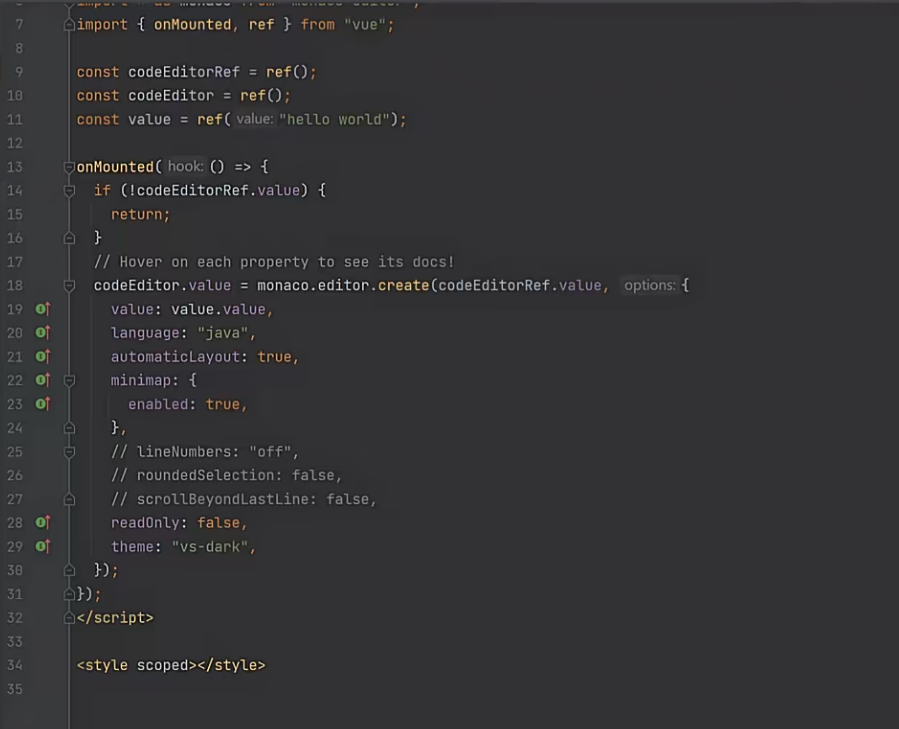

  

# 在线OJ项目重构

目的：之前的OJ项目主要是增删改查，本次重构主要是为了提升对前端技术的掌握和多了解一些docker的知识


主要开发功能设计：

1. 题目模块
   1. 题目的增删改查
   2. 搜索题目
   3. 在线做题
   4. 提交题目
2. 用户
   1. 登录
   2. 注册
3. 判断题目模块
   1. 提交题目（判断结果对错）
   2. 错误处理（内存溢出、安全性、超时）
   3. 实现代码沙箱（隔离环境）
   4. （接口）


### 技术实现

Vue3，Java进程控制，虚拟机，Docker，消息队列

开始开发：

## 2023-7-29

使用组件库：

> https://arco.design/react/docs/start

使用vue-router动态路由

使用vuex全局状态管理

## 2023-7-30

使用vue-router的权限管理

需要在全局页面组件中，绑定一个全局路由监听，每次访问页面的时候，根据用户需要访问的页面的路由信息，先判断用户是否有访问权限

如果有，跳转，如果没有，就拦截或者是跳转到403或者401鉴权或者是登录页面

##### 如何根据权限隐藏菜单

在 routers.ts 中给路由新增一个标志位，用于判断路由是否显隐

不要使用v-if + v-for 去进行条件渲染，会导致性能的浪费

所以先过滤需要展示的页面

需要抽象出一个全局的权限管理


后端项目初始化

然后后端暴露swagger接口，然后使用代码生成工具构建请求函数

> https://github.com/ferdikoomen/openapi-typescript-codegen

```
openapi --input http://localhost:8123/api/v2/api-docs --output ./generated --client axios
```

## 2023-8-7

数据库字段：

使用 judgeConfig 判题配置（json对象）

- 时间限制 timeLimit
- 内存限制 memoryLimit

judge 判题用例（json数组）

每个元素是：一个输入用例和一个输出用例

```json
[
    {
        "input": "1 2",
        "output": "3 4"
    },
    {
        "input": "1 3",
        "output": "2 4"
    }
]
```

存json的前提：

1. 不需要根据json中的某个字段去查询这条数据
2. 你的字段含义相关，属于同一类的值
3. 你的字段存储空间不能占用太大

判题信息：

```json
judgeInfo
{
    "message": "执行信息",
    "time": 1000, // ms
    "memory": 1000 // kb
}
```

判题枚举值：

- Accepted 成功
- Wrong Answer 失败错误
- Compile Error 编译错误
- Memory Limit Exceeded 内存溢出
- Time Limit Exceeded 超时
- Presentation Error 展示错误
- Output Limit Exceeded 输出溢出
- Waiting 等待中
- Dangerous Operation 危险操作
- Runtime Error 运行错误（用户程序问题）
- System Error 系统错误（系统内的问题）

## 2023-8-8

编写独立的实体类entity，DTO，VO等

## 2023-8-14

使用md编辑器：

> [bytedance/bytemd: Hackable Markdown Editor and Viewer (github.com)](https://github.com/bytedance/bytemd)

引入代码编辑器： monaco-editor

> [microsoft/monaco-editor: A browser based code editor (github.com)](https://github.com/microsoft/monaco-editor)
>
> npm install monaco-editor

> 安装：使得代码编辑器和webpack整合
>
> npm install monaco-editor-webpack-plugin

vue-cli项目/ webpack项目整合 Webpack项目

```js
const { defineConfig } = require("@vue/cli-service");
const MonacoWebpackPlugin = require("monaco-editor-webpack-plugin");
module.exports = defineConfig({
  transpileDependencies: true,
  chainWebpack(config) {
    config.plugin(new MonacoWebpackPlugin({}));
  },
});
```



## 2023-8-27

使用
