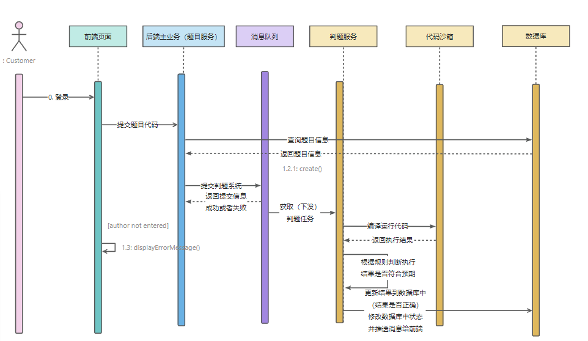

  

# 在线OJ项目重构

目的：之前的OJ项目主要是增删改查，本次重构主要是为了提升对前端技术的掌握和多了解一些docker的知识

主要开发功能设计：

1. 题目模块
   1. 题目的增删改查
   2. 搜索题目
   3. 在线做题
   4. 提交题目
2. 用户
   1. 登录
   2. 注册
3. 判断题目模块
   1. 提交题目（判断结果对错）
   2. 错误处理（内存溢出、安全性、超时）
   3. 实现代码沙箱（隔离环境）
   4. （接口）

### 技术实现

Vue3，Java进程控制，虚拟机，Docker，消息队列

开始开发：

## 2023-7-29

使用组件库：

> https://arco.design/react/docs/start

使用vue-router动态路由